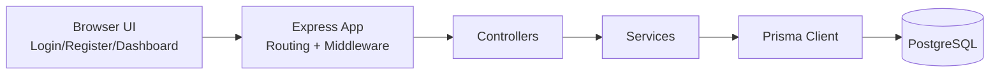

# Secure Inventory Management System
## Runbook, Tech Stack Rationale, and System Design

## 1. Purpose
This document explains:
- How to run the system locally and in production-like environments
- Why each technology was selected
- Why the architecture is structured this way
- End-to-end system design details (API, DB, security, operational concerns)

## 2. Scope and Non-Goals
### In Scope
- Authenticated inventory CRUD for products
- Secure REST API with PostgreSQL persistence
- Frontend integration with clear user flows
- Production-aware foundations (validation, rate limit, error discipline)

### Not Yet Implemented
- Multi-tenant org separation
- Role-based permissions (admin/staff)
- Advanced analytics/reporting
- Queue/event-driven workflows

## 3. How to Run

### 3.1 Prerequisites
- Node.js 18+
- npm 9+
- PostgreSQL database (Railway configured in this project)

### 3.2 Install Dependencies
```bash
npm install
```

### 3.3 Configure Environment
Copy env template and fill values:
```bash
cp .env.example .env
```

Required variables:
- `DATABASE_URL`: PostgreSQL connection string
- `JWT_SECRET`: long random secret (32+ chars recommended)

Optional variables:
- `PORT` (default `5000`)
- `JWT_EXPIRES_IN` (default `1h`)
- `CORS_ORIGIN`
- `RATE_LIMIT_WINDOW_MS`
- `RATE_LIMIT_MAX`

### 3.4 Apply Database Migrations
```bash
npm run prisma:generate
npm run prisma:deploy
```

### 3.5 Start Application
```bash
npm run dev
```

If `5000` is occupied, set another port in `.env` (example: `PORT=5051`).

### 3.6 Access Points
- Login page: `http://localhost:<PORT>/login`
- Register page: `http://localhost:<PORT>/register`
- Dashboard page: `http://localhost:<PORT>/dashboard`
- Health endpoint: `http://localhost:<PORT>/api/health`
- Live deployment: `https://inventory-management-system-production-1cdc.up.railway.app`
- Live health endpoint: `https://inventory-management-system-production-1cdc.up.railway.app/api/health`

## 4. Why This Tech Stack

### Backend: Node.js + Express
- Fast development for REST APIs with large middleware ecosystem
- Good fit for I/O heavy CRUD workloads
- Easy composability for security middlewares (Helmet, CORS, rate limiting)

### Database: PostgreSQL (Railway)
- Strong relational consistency for inventory data
- Native constraints and indexing reduce data integrity risk
- Mature operational tooling and predictable transactional behavior

### ORM: Prisma
- Type-safe database access patterns
- Migration workflow simplifies schema evolution
- Reduces raw SQL boilerplate while preserving SQL-grade control

### Auth: JWT + bcrypt
- Stateless access tokens simplify API scaling
- bcrypt provides industry-standard password hashing

### Frontend: Vanilla HTML/CSS/JS
- Keeps focus on engineering fundamentals instead of framework complexity
- Minimal runtime overhead, easy to review in technical assessment

## 5. Architecture Overview



### Layer Responsibilities
- `routes/`: endpoint definitions and middleware composition
- `controllers/`: HTTP-level orchestration (request/response)
- `services/`: business logic and DB interactions
- `validators/`: input contract enforcement
- `middlewares/`: cross-cutting concerns (auth, rate limit, error handling)
- `config/`: environment and infrastructure clients
- `utils/`: shared primitives (response shape, async handler, custom errors)

Why this separation:
- Reduces coupling between HTTP and core logic
- Improves testability (service layer can be tested independently)
- Supports maintainability as features grow

## 6. Request Lifecycle and Control Flow
1. Request enters Express app.
2. Security middleware runs (`helmet`, `cors`, `rateLimit`, JSON size limit).
3. Route-specific validators sanitize and validate payload.
4. Auth middleware verifies bearer token for protected routes.
5. Controller calls service method.
6. Service performs business checks and Prisma DB operations.
7. Standard success/error response envelope returned.
8. Central error handler maps unhandled errors to safe HTTP responses.

## 7. API Design

### 7.1 Resource Model
- Auth resource: `/api/auth`
- Product resource: `/api/products`

### 7.2 Method Semantics
- `GET` for retrieval
- `POST` for creation
- `PATCH` for partial update
- `DELETE` for removal

### 7.3 Response Contract
- Consistent envelope for both success and error
- Supports predictable frontend parsing and logging

Success:
```json
{ "success": true, "message": "...", "data": {} }
```

Error:
```json
{ "success": false, "message": "...", "details": [] }
```

### 7.4 Status Code Discipline
- `200`: successful read/update/delete
- `201`: successful create
- `400`: validation or business rule conflict (duplicate SKU/email)
- `401`: missing/invalid auth credentials
- `404`: resource or route not found
- `500`: unexpected internal error

## 8. Data Model and Integrity

### Product
- `id` UUID primary key
- `sku` unique + indexed
- `price` decimal(10,2)
- `quantity` integer
- DB check constraints enforce `price >= 0`, `quantity >= 0`

### User
- `id` UUID primary key
- `email` unique + indexed
- `passwordHash` bcrypt hash only (no plain password storage)

Integrity enforcement levels:
- API validation layer rejects malformed input early
- Service layer applies business checks (duplicate conflicts, not found)
- Database constraints provide final integrity guarantees

## 9. Security Design

### Implemented Controls
- Input validation and sanitization on write endpoints
- JWT authentication for all product routes
- Password hashing with bcrypt (salted)
- Rate limiting on `/api`
- Helmet secure headers
- CORS allowlist via environment config
- Request body size limit
- Centralized error handling without stack trace leakage
- Secrets loaded from environment (no hardcoded credentials)

### Threats Addressed
- Injection-like malformed payloads: mitigated via validation/sanitization
- Credential compromise impact: limited by hashed passwords
- Brute-force/API abuse: reduced by rate limiting
- Information disclosure: mitigated by generic internal errors

## 10. Frontend Integration Design

Pages:
- `/login`: authentication
- `/register`: account creation
- `/dashboard`: inventory management (requires token)

Client behavior:
- Stores JWT in `localStorage`
- Attaches token in `Authorization: Bearer <token>`
- Handles loading state, validation errors, API failure states
- Redirects unauthenticated users to `/login`

## 11. Deployment and Environment Strategy

### Environment Strategy
- All runtime config via `.env`
- Separate values per environment (dev/stage/prod)

### Migration Strategy
- Versioned Prisma migrations under `prisma/migrations`
- Deploy step runs `prisma migrate deploy` to avoid drift

### Railway Runtime Commands
- Build command: `npm install`
- Start command: `npx prisma migrate deploy && node src/server.js`
- Health check path: `/api/health`

### Health Monitoring
- `/api/health` exposes liveness basics (`uptime`, timestamp)

## 12. Scalability and Evolution Path

Near-term improvements:
- Add pagination/search/filter to products endpoint
- Add unit/integration tests with CI pipeline
- Introduce refresh tokens + logout invalidation
- Add role-based authorization
- Add structured audit log for stock mutations

Scale-out options:
- Run multiple stateless API instances behind load balancer
- Use managed Postgres with read replicas for heavy read traffic
- Add Redis for token/session throttling and hot-data caching
- Move expensive workflows to background jobs (queue)

## 13. Reliability and Operational Practices
- Fail-fast on missing critical env variables
- Uniform logs and standardized error format
- DB constraints to guard against application-level misses
- Explicit migration history for reproducible deployments

## 14. Architectural Tradeoffs
- JWT in localStorage is simple for this assignment but has XSS risk in larger systems; hardened production setups may prefer HttpOnly cookies with CSRF defenses.
- Vanilla frontend minimizes complexity and meets requirements; larger products should adopt component architecture and typed frontend tooling.
- Synchronous API flow is enough for CRUD; event-driven patterns can be introduced when throughput/side effects grow.

## 15. Conclusion
This system is intentionally designed as a secure, maintainable baseline for real-world SMB inventory workflows. It prioritizes clear boundaries, data integrity, and operational safety while leaving clean extension points for growth.
